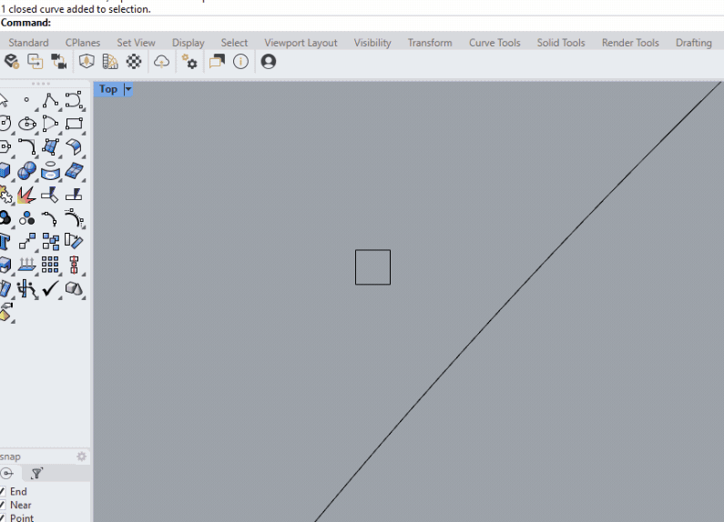
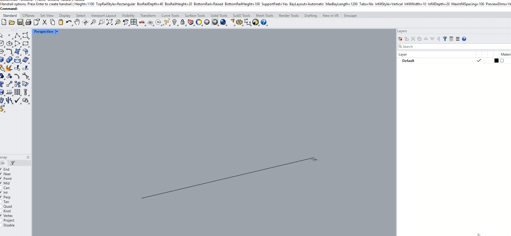
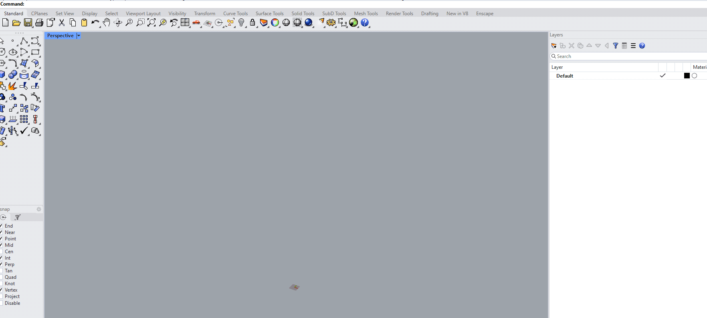

  

# Numbat

Numbat is a collection of architectural modelling and analysis tools for Rhino 8. Commands use the `nb` prefix and are intended for small, repeatable production tasks that would otherwise require manual setup or repeated modelling operations.

## Installation

Open **Rhino Package Manager**, enable **Include pre-releases**, search for **Numbat**, and install the package.

## Analysis commands

### nbGFA

Calculates gross floor area from selected closed polysurfaces. The command identifies the lowest face of each selected solid, validates that the face is horizontal and planar, rejects contained volumes, and reports the combined area in square metres.

### nbProgramBlocks

Creates area-scaled program blocks from tab-separated data copied from Excel. The first three columns are interpreted as program name, area in m2, and category; later columns are ignored. Each program becomes a block containing a plan rectangle and either text objects or a text dot, with an optional 3.5 m-high volume. Categories are placed on child layers below `nbPROGRAM` and assigned sequential pastel colours. Category rows are arranged downward in negative Y, with programs running left to right.

Program areas are always interpreted as square metres and are converted to the active Rhino model units. Pressing Enter at the placement prompt uses 0,0,0. Multi-line Excel cells are not supported. Category names that resolve to the same valid Rhino layer name are treated as the same category. Repeated program names create separate block definitions with numeric suffixes, for example `Program_Kitchen_2`.

## Modelling commands

### nbRandomColour

Randomises Rhino layer colours. Colours can be assigned independently to every layer or generated by top-level layer group with lighter nested-layer variations.

### nbTextureShuffle

Collects texture-mapping shuffle options for selected surfaces, polysurfaces and meshes. The current implementation reports the selected mapping settings but does not yet modify object texture mapping.

### nbPavementPlacer

Arrays a paving module along selected curves with controls for rows, gaps, rotation, scale variation, side and start-point behaviour.

  

### nbHandrail

Generates configurable architectural handrails from selected curves. Available construction includes top and bottom rails, posts, vertical or zig-zag infill, framed panels, sheets, end tabs and support feet.

  

### nbPV

Places photovoltaic panel arrays on selected roof geometry. The command provides controls for panel and frame dimensions, stand height, tilt, gaps, parapet margin, rotation and fit mode.

### nbStair

Starts the stair generator and provides a choice between the straight and spiral stair commands.

### nbStairStraight

Generates straight stairs with configurable construction, landings, switchbacks and stringers using a preview-and-bake workflow.

  

### nbStairSpiral

Generates spiral stairs with configurable stair construction, central column, treads, balusters, handrail, skin and soffit options.

  

### nbTemplate

Recreates the Numbat template layer structure and places reference geometry and layer-path labels for the generated layers.

## License

Numbat is licensed under the MIT License. See [LICENSE](LICENSE).
